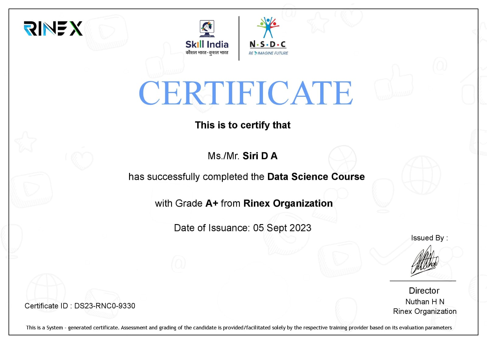
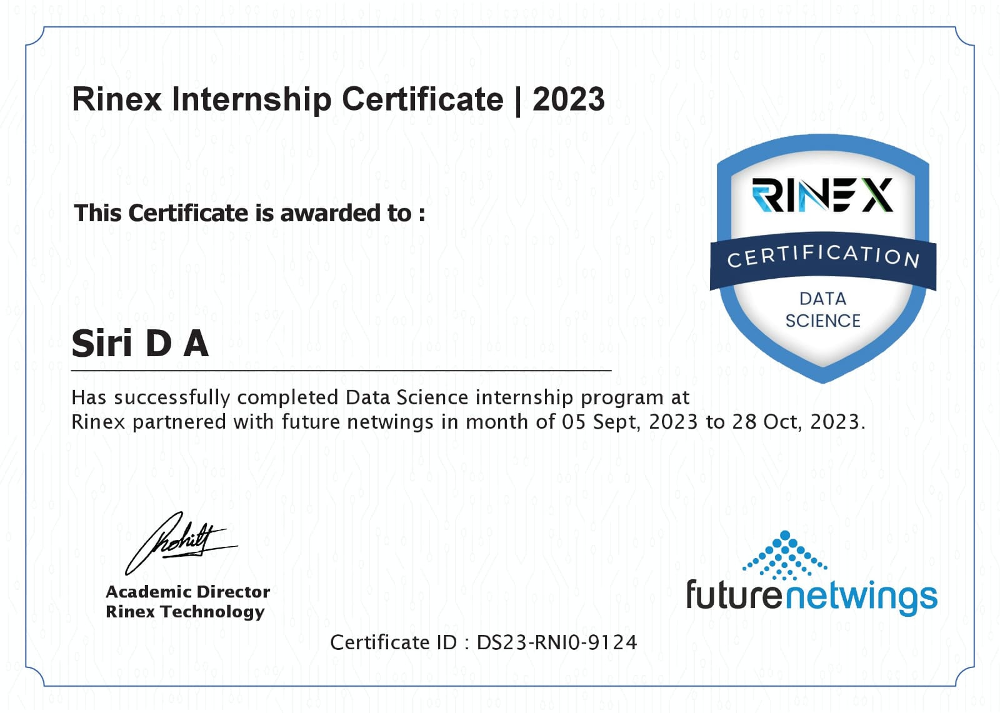

# Data Science Notebooks

This repository contains my Data Science coursework notebooks developed during my Data Science course.

It covers Python programming, data analysis, visualization, and machine learning using **Python**, **Pandas**, **Scikit-learn**, and **Google Colab**.

## Topics Covered

- **Python Programming Fundamentals**
- **Exploratory Data Analysis (EDA) & Data Visualization**
- **Data Preprocessing**
- **Machine Learning Fundamentals (Regression & Classification)**
- **Model Training and Evaluation**

## Repository Structure

```text
Data-Science-Notebooks/
├── 01_Python/
│   ├── Python.ipynb
│   ├── nba.csv
│   └── Titanic.csv
├── 02_Machine_Learning/
│   └── Machine_Learning.ipynb
├── 03_Case_Studies/
│   ├── Breast_Cancer/
│   ├── Car_Price_Prediction/
│   ├── Medical_Insurance_Cost_Prediction/
│   ├── Rock_Vs_Mine_Prediction/
│   ├── Spam_Email/
│   └── Wine_Quality_Prediction/
├── 04_Mini_Projects/
│   ├── Store_Sales_Analysis/
│   │   ├── Store_Sales_Analysis.ipynb
│   │   └── Store_Sales.xlsx
│   └── USA_Cars_Analysis/
│       ├── USA_Cars_Analysis.ipynb
│       └── USA_cars_datasets.csv
├── 05_Major_Project/
│   ├── NBA_Players_Analysis.ipynb
│   ├── nba.csv
│   └── nba_sample.csv
├── assets/
│   ├── CourseCompletionCertificate.jpeg
│   └── InternshipCompletionCertificate.jpeg
├── .gitignore
└── README.md
```

## Case Studies

Launch any notebook directly in Google Colab:

| Case Study | Dataset / Focus | Open in Colab |
| :--- | :--- | :---: |
| **Breast Cancer Classification** | Predicting whether a tumor is benign or malignant using medical features. | [](https://colab.research.google.com/github/sirida20/Data-Science-Notebooks/blob/main/03_Case_Studies/Breast_Cancer/Breast_Cancer_Project.ipynb) |
| **Car Price Prediction** | Estimating market prices of used cars based on details like age and model. | [](https://colab.research.google.com/github/sirida20/Data-Science-Notebooks/blob/main/03_Case_Studies/Car_Price_Prediction/Car_Price_Prediction.ipynb) |
| **Medical Insurance Cost** | Predicting personal insurance charges based on age, BMI, and lifestyle habits. | [](https://colab.research.google.com/github/sirida20/Data-Science-Notebooks/blob/main/03_Case_Studies/Medical_Insurance_Cost_Prediction/Medical_Insurance_Cost_Prediction.ipynb) |
| **Rock vs. Mine Prediction** | Classifying underwater objects as rocks or naval mines using sonar signals. | [](https://colab.research.google.com/github/sirida20/Data-Science-Notebooks/blob/main/03_Case_Studies/Rock_Vs_Mine_Prediction/Rock_vs_Mine_Prediction.ipynb) |
| **Spam Email Classification** | Identifying spam emails by analyzing and processing email text data. | [](https://colab.research.google.com/github/sirida20/Data-Science-Notebooks/blob/main/03_Case_Studies/Spam_Email/Spam_Email_Project.ipynb) |
| **Wine Quality Prediction** | Assessing wine quality scores using chemical characteristics. | [](https://colab.research.google.com/github/sirida20/Data-Science-Notebooks/blob/main/03_Case_Studies/Wine_Quality_Prediction/Wine_Quality_Prediction.ipynb) |

## Projects

### Mini Projects
* **USA Cars Analysis** — Exploratory Data Analysis on vehicle attributes, brand pricing aggregations, color distributions, vehicle age calculations, and clean title filtering.
* **Store Sales Analysis** — Retail order analytics across customer segments, time-based breakdown via order date parsing (month/year), order priority tracking, and Seaborn line/scatter visualizations.

### Major Project
* **NBA Players Analysis** — Data cleaning, player salary/demographic analytics, weight unit conversions, custom BMI calculations with categorical evaluations, and Matplotlib bar and line visualizations.

## Technologies Used

- **Language:** Python 3.x
- **Environment:** Google Colab, VS Code / Jupyter Notebook
- **Libraries:** NumPy, Pandas, Matplotlib, Seaborn, Scikit-Learn, OpenPyXL

## How to Run Locally

1. **Clone the repository:**
   ```bash
   git clone https://github.com/sirida20/Data-Science-Notebooks.git
   cd Data-Science-Notebooks
   ```

2. **Install dependencies:**
   ```bash
   pip install numpy pandas matplotlib seaborn scikit-learn openpyxl
   ```

3. **Open VS Code or launch Jupyter Notebook to run any file locally:**
   ```bash
   jupyter notebook
   ```

## Certifications
These certificates were completed as part of my data science coursework:

<div align="center">
  
  
</div>